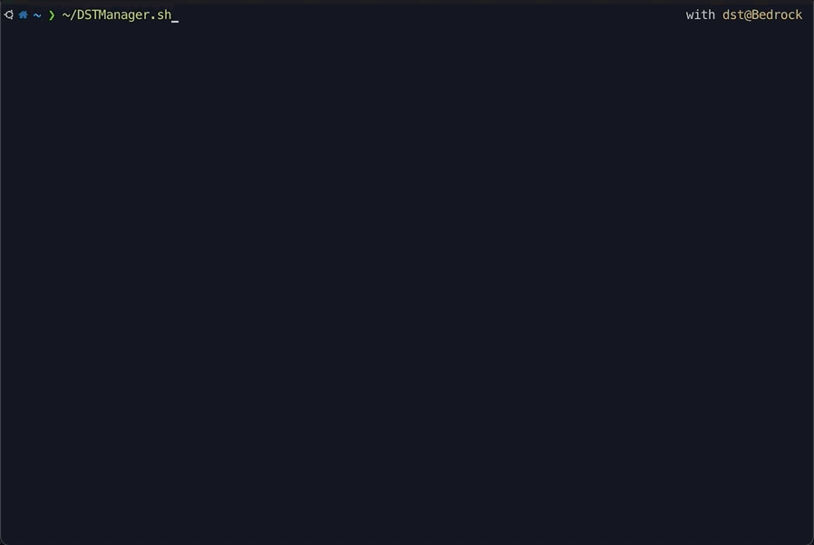
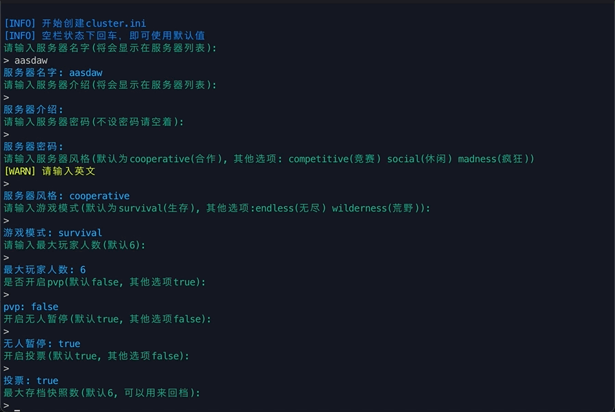
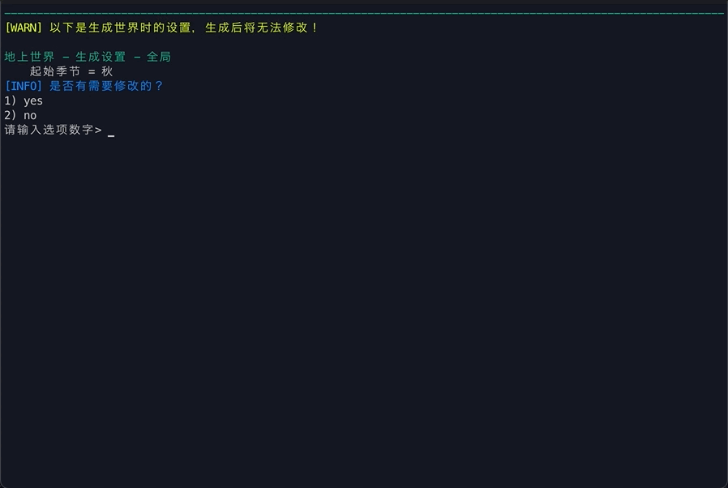
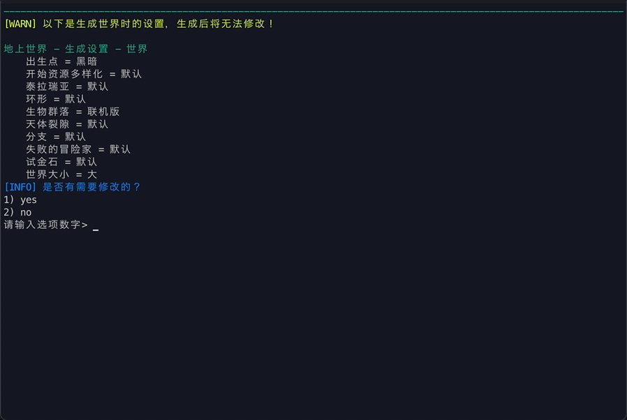
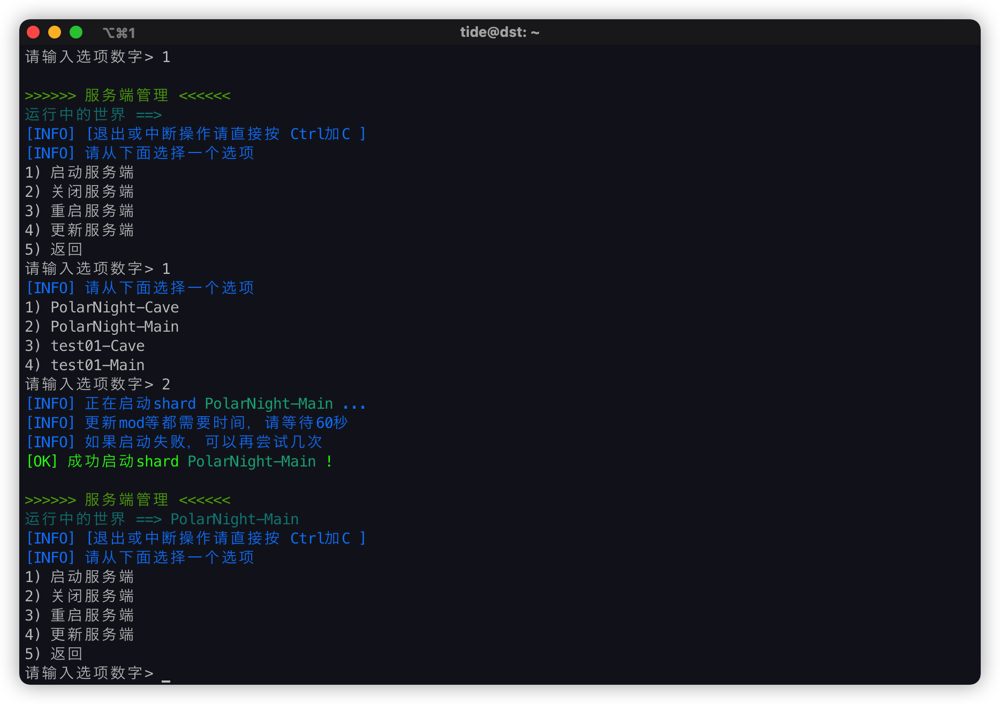
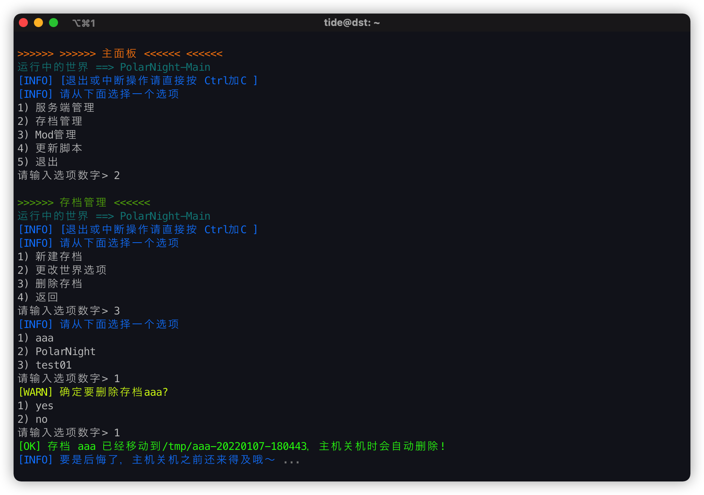
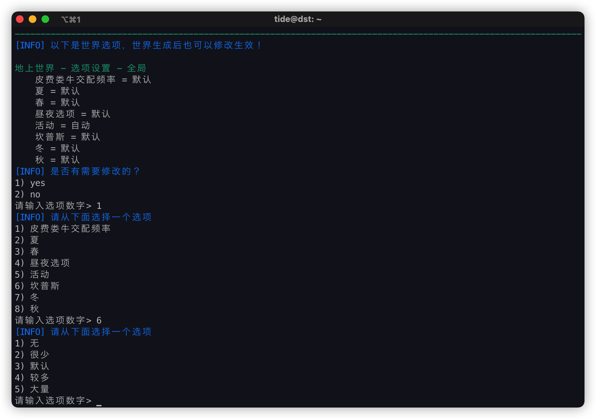
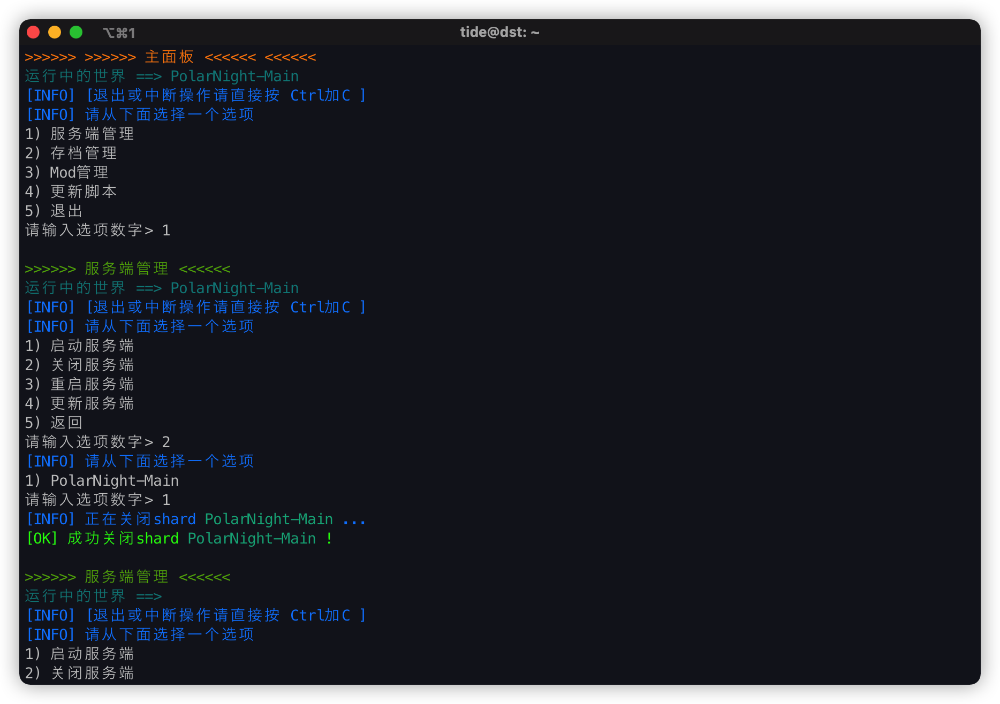

# DSTServerManager

## 基本介绍

这是一个用来管理饥荒联机服务器的脚本！  
目前公开的各种脚本，基本都已年久失修，没人维护了。  
比如贴吧置顶的go.sh, 还有我以前经常用的dstserver.sh。  

这个脚本使用的配置是参考了最新客户端生成的存档文件，  
各种设置都是最新的，比如有泰拉瑞亚的选项hh  
并会根据服务器状况自动选择32位或者64位dst服务端

## 下载使用

- 首先要把脚本放到服务器上面  
    虽然直接上传`DSTManager.sh`并运行也可以  
    但还是推荐使用命令直接从仓库下载, 只需要一行!
    ```shell
    cd ~ && git clone https://gitee.com/yechentide/DSTServerManager && ln -s ~/DSTServerManager/DSTManager.sh ~/DSTManager.sh
    ```
- 日常使用使用下面的命令
    ```shell
    ~/DSTManager.sh
    ```

## 功能

### 想添加的功能

想添加, 不代表最后都会添加, shellscript和lua语言我写烦了...
- 服务端管理
    - [x] 启动32位服务端
    - [x] 启动64位服务端
    - [x] 关闭服务器
    - [x] 重启服务端
    - [x] 更新服务端
    - [ ] 自动更新服务端
- 存档管理
    - [x] 新建存档(地上+地底)
    - [x] 单世界存档(仅地上or仅地底, 多主机服务器)
    - [x] 整理世界设置, 用lua写model
    - [x] 使用lua编辑世界设置
    - [x] 建好的存档的世界选项修改功能
    - [x] 删除存档
    - [ ] 撤销删除功能
    - [ ] 备份存档
    - [ ] 还原存档
    - [ ] 导入本地存档
    - [ ] 白名单/黑名单/管理员名单管理
    - [ ] 开启测试服功能
- Mod管理
    - [ ] 添加Mod
    - [ ] 删除Mod
    - [ ] 配置Mod
    - [ ] 更新Mod
- 命令行
    - [ ] 提供dst控制台输入界面
    - [ ] 提供特定命令的快捷选项
- 其他工具
    - [ ] 文件位置结构输出功能(类似tree命令的输出)
    - [ ] 玩家上线记录
    - [ ] 显示进过服务器的玩家列表
    - [ ] 青少年模式
- 脚本相关
    - [ ] 后台检测脚本更新
    - [x] 更新脚本
    - [ ] 切换远程仓库
- 帮助(这个大部分以说明为主)
    - [ ] 添加帮助函数
    - [ ] 单主机服务器开服帮助
    - [ ] 双主机服务器开服帮助
    - [ ] 本地存档上传帮助
    - [ ] 其他脚本迁移帮助
    - [ ] 其他脚本介绍&下载
- 其他
    - [x] 统一代码风格， 并使用`declare`来声明变量
    - [ ] 更新README以及docs

### 使用界面

- 启动脚本

- 新建存档

- 配置世界01

- 配置世界02

- 启动服务器

- 删除存档

- 配置世界03

- 关闭存档

