# DSTServerManager

## 目录

- [DSTServerManager](#dstservermanager)
    - [目录](#目录)
    - [基本介绍](#基本介绍)
    - [下载使用](#下载使用)
        - [系统/用户要求](#系统用户要求)
        - [下载脚本](#下载脚本)
        - [执行脚本](#执行脚本)
    - [测试人员](#测试人员)
    - [功能](#功能)
        - [想添加的功能](#想添加的功能)
    - [界面预览](#界面预览)
        - [准备阶段(第一次运行)](#准备阶段第一次运行)
        - [主面板](#主面板)
        - [服务器管理](#服务器管理)
        - [存档管理](#存档管理)
        - [Mod管理](#mod管理)

## 基本介绍

这是一个用来管理(Steam版)饥荒联机服务器的脚本！  
贴吧置顶教程里的go.sh脚本，已经年久失修，不适合现在版本的饥荒了。  
我以前经常用`dstserver.sh`, 但因为某些原因我决定重写一个。  

开服脚本说实话都大同小异。那么说说这个脚本的特点吧。  
我觉得有两个:
- 更好的输出。脚本里写了好几个专门用来输出的函数, 使用不同颜色来让输出更易懂。
- 扩展性好点。添加选项, 添加设置, 添加新模板, 添加新功能, 都比较方便。

如果你想了解文件夹结构, 请看[这里](./docs/结构.md)。  
如果你想了解本脚本并修改, 请看[这里](./docs/脚本说明.md)。

## 下载使用

### 系统/用户要求

- 本脚本只支持64位系统(所以默认使用64位饥荒服务端)
- 本脚本目前只支持Ubuntu/CentOS, 稍微改下应该可以支持Redhat系列和Debian系列的Linux系统
- 本脚本禁止root用户执行
- 推荐由root用户下载完依赖包后, 使用普通用户执行
- 或者使用有sudo权限的用户执行
    - 如果你可以登陆root用户, 你也可以自己给别的用户加sudo权限
    - Ubuntu: `gpasswd -a 用户名 sudo`
    - CentOS: `gpasswd -a 用户名 wheel`

### 下载脚本

你需要先把脚本放到服务器上面。  
在服务器上面使用下面这一行命令就能下载好了:
```shell
cd ~ && git clone https://gitee.com/yechentide/DSTServerManager && ln -s ~/DSTServerManager/DSTManager.sh ~/DSTManager.sh
```
- 注1: 如果你电脑上有`DSTManager.sh`文件, 你也可以手动上传。但是版本1.3以前, 更新功能貌似没写好。推荐用上面命令直接下载
- 注2: 上面的命令使用了gitee的链接。如果你的服务器在国外, 推荐使用github。只需要把上面的`gitee`改成`github`就行

### 执行脚本

执行脚本输入这个就行。
```shell
~/DSTManager.sh
```
注: 第一次运行脚本并安装完依赖后, 重新登录主机即可输入`dst`并回车来执行脚本!

## 测试人员

感谢以下人员帮忙测试脚本！mua！  
- RITENU
- Dr.Toby

## 功能

### 想添加的功能

shellscript和lua语言我写烦了, 剩下的看看有没有勇士出现hh...
- 服务端管理
    - [x] 启动64位服务端
    - [x] 关闭服务器
    - [x] 重启服务端
    - [x] 更新服务端
    - [x] 一次性启动存档内全部世界
    - [x] 单独启动存档内世界
    - [ ] 自动更新服务端
    - [x] 进入控制台
    - [ ] 提供特定控制台命令的快捷选项
    - [ ] 备份log
- 存档管理
    - [x] 新建存档时可以灵活添加世界(参考了`dstserver.sh`)
    - [x] 更灵活的编辑cluster.ini
    - [x] 建好存档后修改cluster.ini
    - [x] 更灵活的编辑server.ini
    - [x] 建好存档后修改server.ini
    - [x] 更灵活的编辑worldgenoverride.lua
    - [x] 建好存档后修改worldgenoverride.lua
    - [x] 删除存档
    - [ ] 撤销删除功能
    - [ ] 备份存档
    - [ ] 还原存档
    - [ ] 导入本地存档
    - [ ] 白名单/黑名单/管理员名单管理
    - [ ] 开启测试服功能
- Mod管理
    - [x] 下载Mod
    - [x] 添加Mod到存档
    - [x] 配置特定存档的Mod
    - [x] 更新Mod
    - [x] 删除Mod
- 脚本相关
    - [x] 后台检测脚本更新
    - [x] 更新脚本
    - [ ] 切换远程仓库
- 其他工具
    - [ ] 文件位置结构输出功能(类似tree命令的输出)
    - [ ] 玩家上线记录
    - [ ] 显示进过服务器的玩家列表
- 帮助中心(这个大部分以说明为主)
    - [ ] 添加帮助函数
    - [ ] 端口/防火墙/安全组设置帮助
    - [ ] 单主机服务器开服帮助
    - [ ] 双主机服务器开服帮助
    - [ ] 本地存档上传帮助
    - [ ] 其他脚本迁移帮助
    - [ ] 其他脚本介绍&下载

## 界面预览

### 准备阶段(第一次运行)

- 下载并运行

- 下载依赖包

- 下载依赖包结束


### 主面板

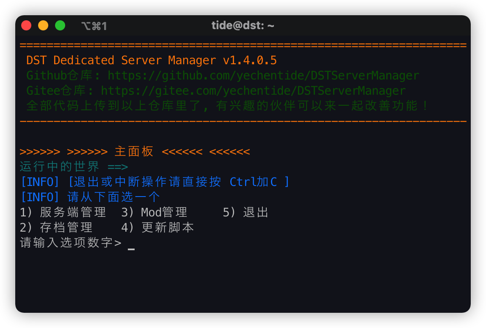

### 服务器管理

- 启动 & 关闭服务端

- 操作控制台
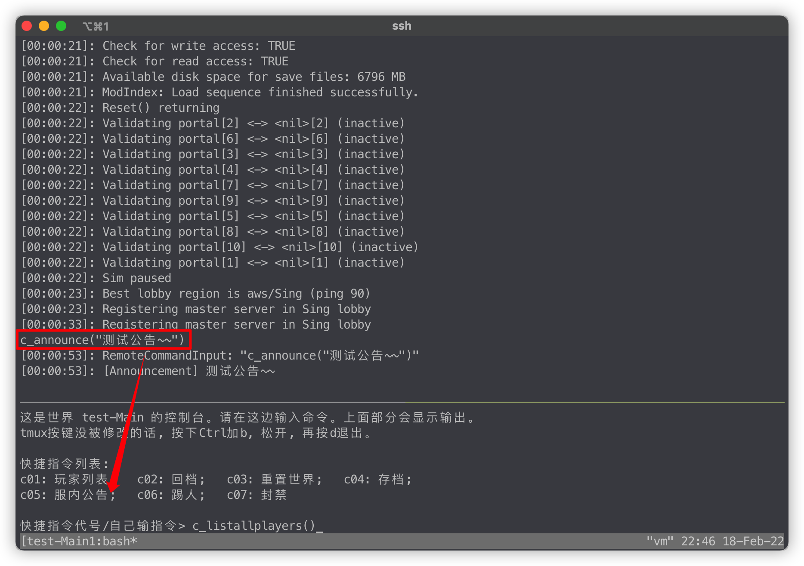

### 存档管理

- 新建存档
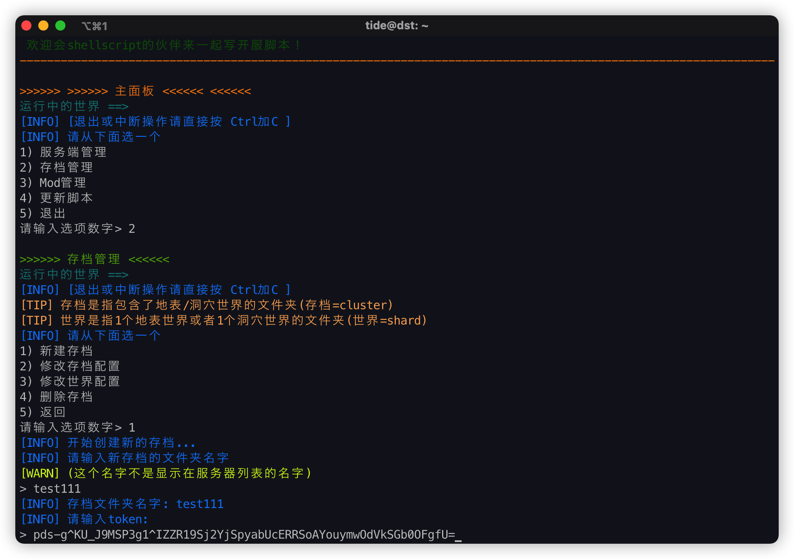
- 配置cluster.ini
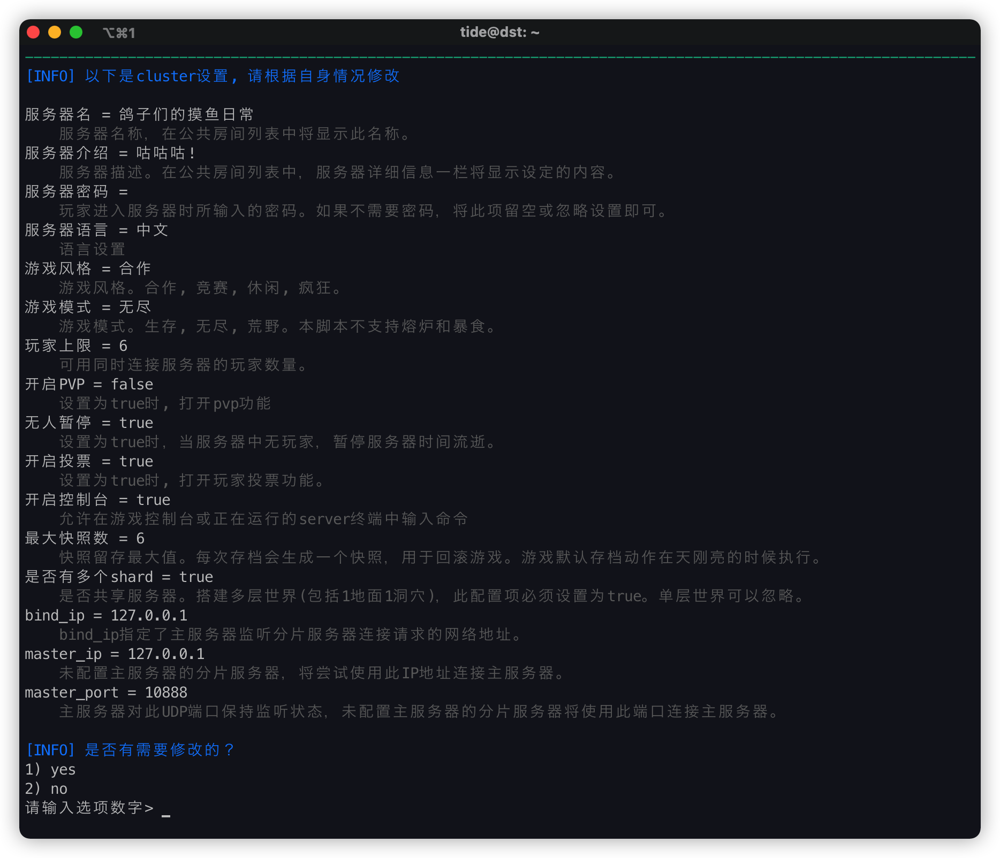
- 修改cluster.ini设置
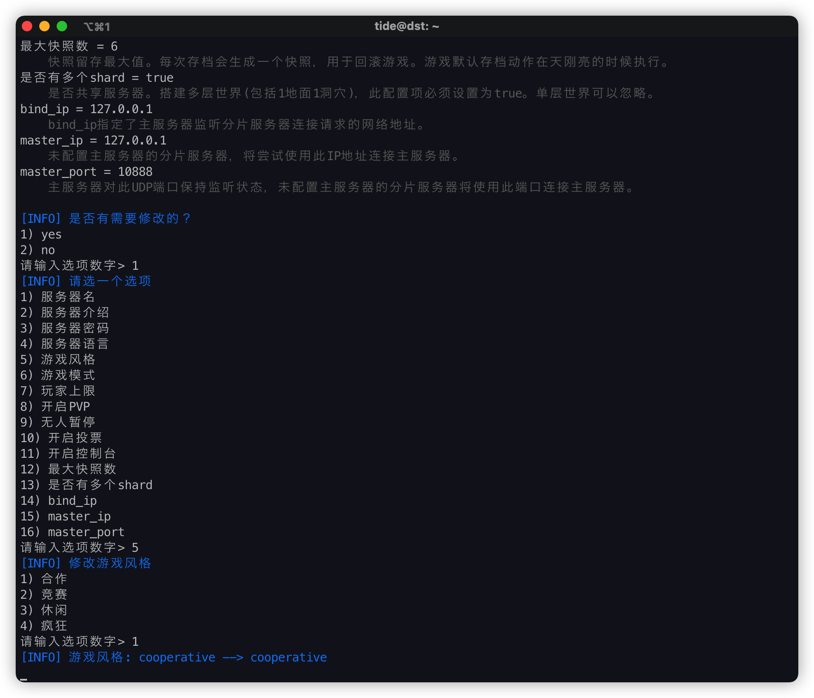
- 往存档里添加世界
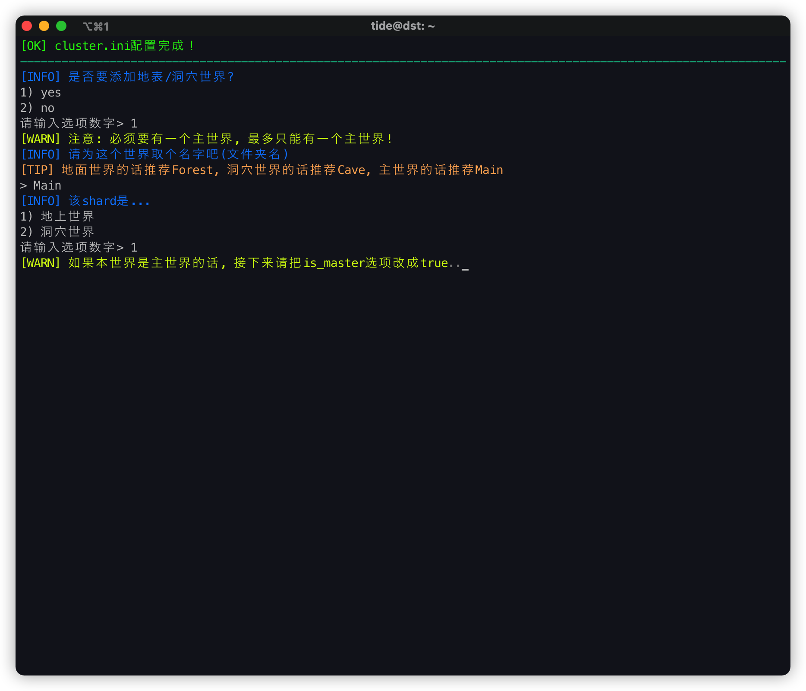
- 修改server.ini
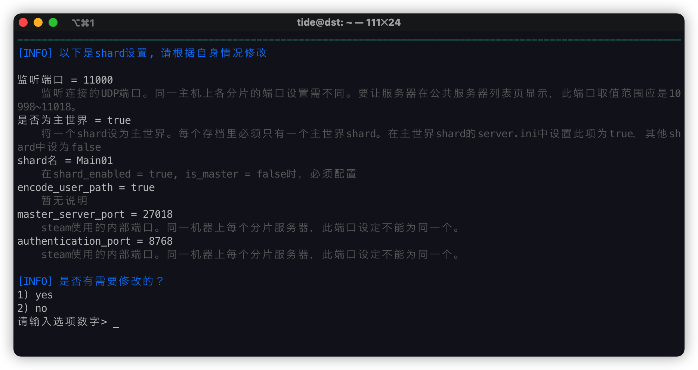
- 选择世界配置模板  
    目前只添加了默认配置的模板和泰拉瑞亚的模板  
    要添加新的模板, 可以往`templates/world_presets`文件夹里面添加

- 修改世界配置
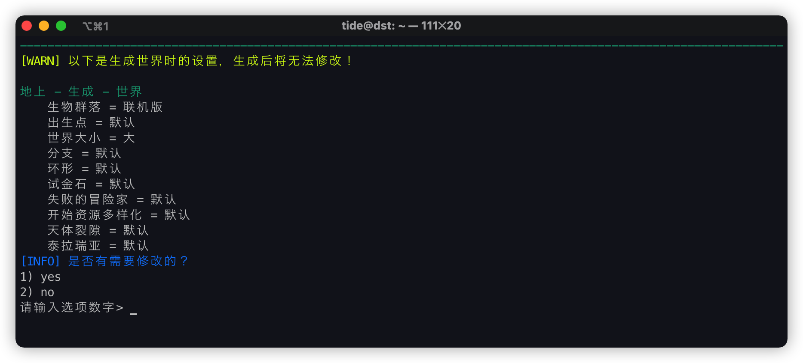
- 删除存档


### Mod管理

- 下载Mod
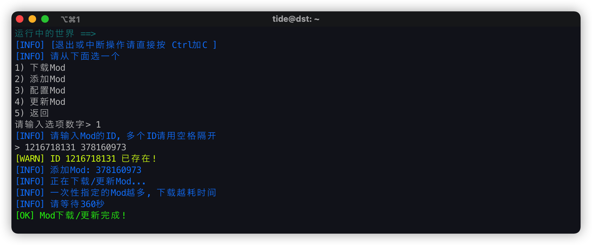
- 添加Mod到存档
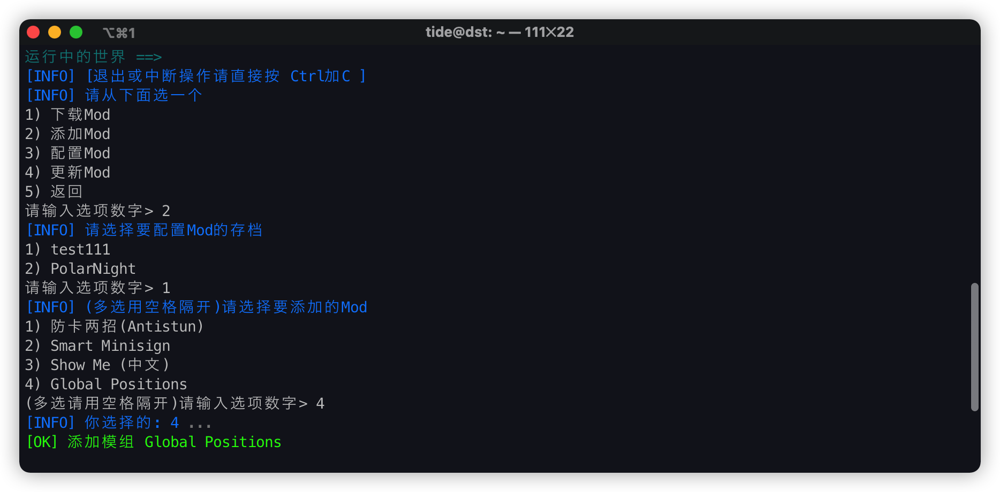
- 配置Mod
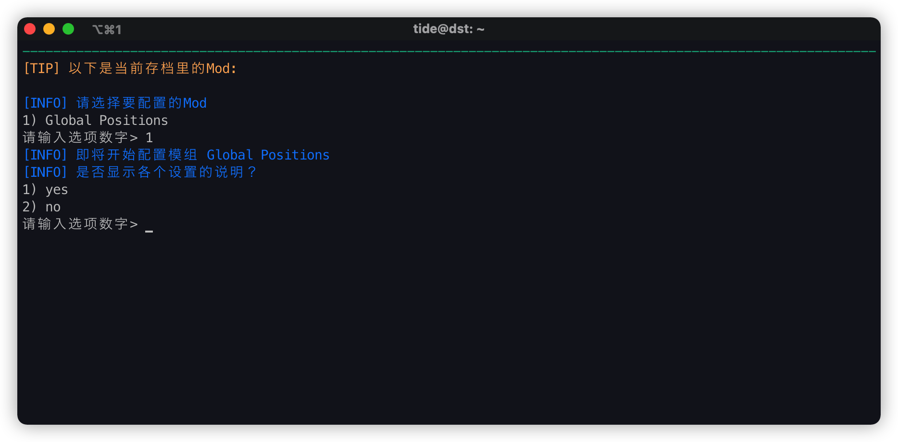
- 配置Mod
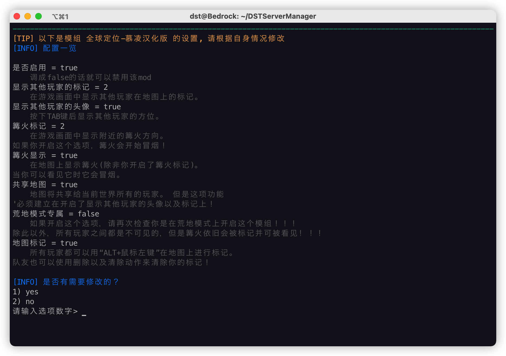
