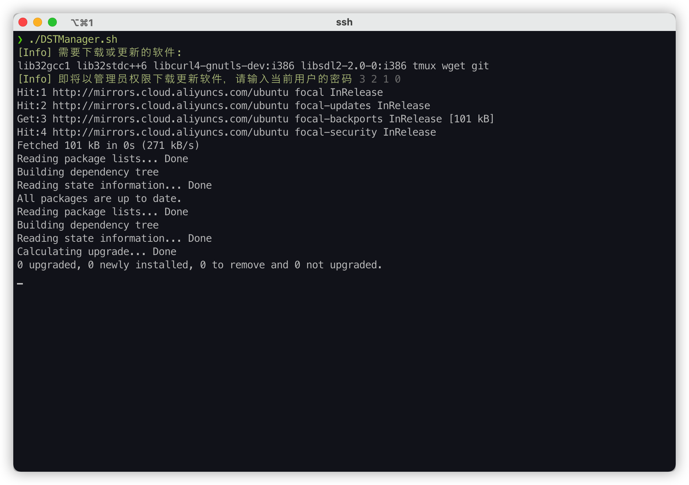
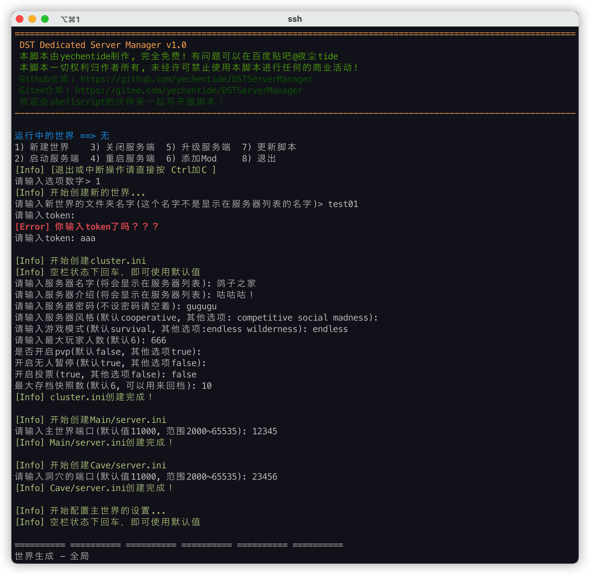
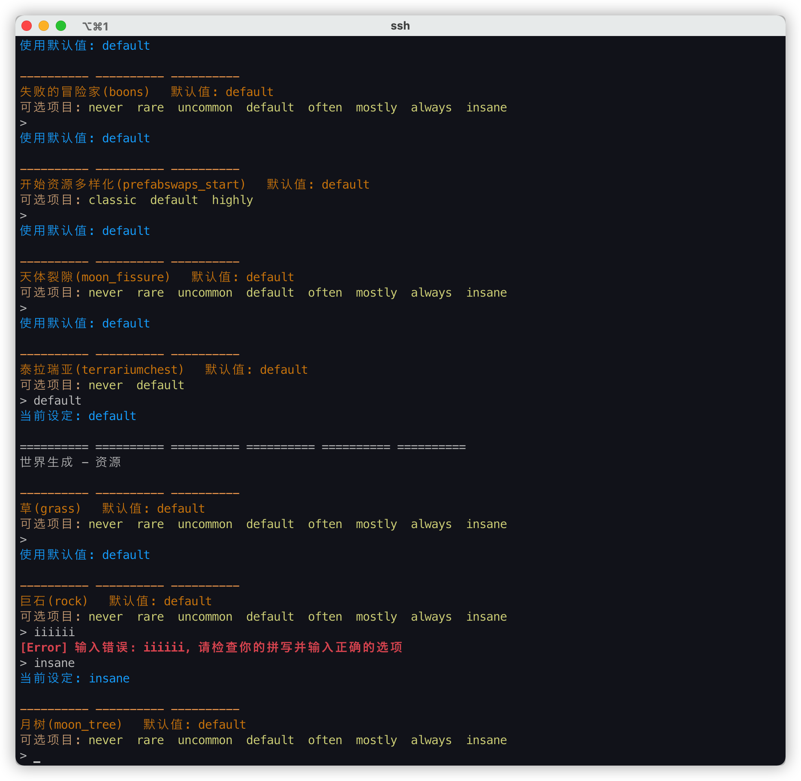

# DSTServerManager

## 基本介绍

这是一个用来管理饥荒联机服务器的脚本！  
目前公开的各种脚本，基本都已年久失修，没人维护了。  
比如贴吧置顶的go.sh, 还有我以前经常用的dstserver.sh。  

这个脚本使用的配置是参考了最新客户端生成的存档文件，  
各种设置都是最新的，比如有泰拉瑞亚的选项hh  
并会根据服务器状况自动选择32位或者64位dst服务端

## 下载使用

有两种方法：

1. 将`DSTManager.sh`文件上传到服务器，运行`~/DSTManager.sh`。它会帮你配置环境。
2. 无需上传任何东西，在服务器直接运行下面两行代码

  ```shell
  cd ~ && git clone https://gitee.com/yechentide/DSTServerManager && ln -s ~/DSTServerManager/DSTManager.sh ~/DSTManager.sh
  ~/DSTManager.sh
  ```

## 功能

### 已添加

- [x] 开启服务端(32位&64位)
- [x] 关闭服务端
- [x] 升级服务端
- [x] 新建世界
- [x] 添加mod
- [x] 更新自己






### 待添加

- [ ] 删除mod
- [ ] 管理白名单，黑名单，管理员名单
- [ ] 更多的检测机制
- [ ] 存档备份，还原，删除功能
- [ ] 自动更新服务端功能
- [ ] 只开主世界，只开洞穴的功能(多主机服务器)
- [ ] 开启测试服功能
